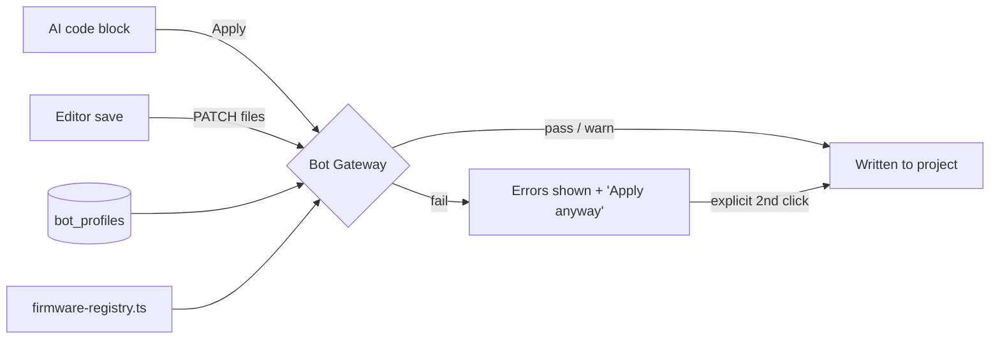

# Bot Gateway — "understand the bot, not the code"

> Status: **implemented (v1 rubric)**. The gateway is live in the editor apply
> flow and the file-save API. Real compilation plugs in later via the Forge
> Local Agent (see `docs/robot-deploy-architecture.md`).

## The problem

AI assistants confidently generate robot code that compiles in their head but
not on the student's robot: motors on ports that hold sensors, OkapiLib calls
on a PROS 4 kernel, `pros::Motor(5, gearset, true)` constructors that were
removed a major version ago, or code that's simply truncated mid-function.
Generic linters can't catch any of this because the failure isn't in the code
— it's in the mismatch between the code and *this specific robot*.

## The idea

Forge keeps a **bot profile** per project: the exact robot — VEXos firmware,
PROS kernel version, brain type, and a full port map (21 smart ports + 8 ADI
ports, each with a component type, label, reversed flag, and gearset). Every
piece of generated code passes through a **validation gateway** that checks it
against that profile before it can be applied.

### The 80/80 philosophy

The v1 gateway is a static rubric, not a compiler. The target is pragmatic:

- Code that **passes** the gateway should do what it claims on the real robot
  **~80% of the time** — a massive improvement over unchecked LLM output.
- The rubric aims to catch **~80% of the hallucination classes** we actually
  see (wrong ports, wrong types, wrong-kernel APIs, truncated output) with
  near-zero false confidence: when the gateway can't tell, it stays quiet
  (info) rather than guessing.

Verdicts are advisory-with-teeth: a **fail** requires an explicit
"Apply anyway" from the student (they own the robot; Forge doesn't), and
editor saves are never blocked — the report simply rides along.

## Architecture



### Pieces

| Piece | Where | Role |
|---|---|---|
| Data model | `bot_profiles` table (`src/lib/db/schema.ts`, mirrored in `SCHEMA_SQL` and `scripts/init-turso-db.mjs`) | One profile per project; `components` is a JSON array of `{ port, type, label, reversed?, gearset? }` |
| Profile CRUD | `src/lib/gateway/profile.ts` | Typed get/upsert/delete |
| Firmware registry | `src/lib/gateway/firmware-registry.ts` | Data-driven catalog of PROS kernel majors (3.x / 4.x), VEXos releases, and API availability/deprecation rules |
| Rubric engine | `src/lib/gateway/rubric.ts` | `runGateway(code, profile): GatewayReport` — static analysis, no compiler |
| API | `GET/PUT /api/projects/[id]/bot-profile`, `POST /api/projects/[id]/gateway` | Guarded by `requireProjectAccess`; the gateway check is viewer-level (read-only analysis) so the public demo works |
| Enforcement | `PATCH /api/projects/[id]/files` (report attached to save response), `CodeEditBlock` (pre-apply check, fail ⇒ "Apply anyway") | The two paths code takes into a project |
| UI | `src/components/project/BotProfilePanel.tsx` at `/projects/[id]/bot-profile`, linked from the project sidebar | Firmware/kernel dropdowns + 21+8 port map editor |

## The rubric (v1)

All checks run on comment/string-stripped source so line numbers stay exact.

1. **Port validation** — every port referenced in code
   (`pros::Motor(1)`, `Motor left(-3)`, `pros::MotorGroup({1, -2})`,
   `pros::Rotation(11)`, `pros::adi::DigitalIn('A')`, C-API calls like
   `motor_move(7, …)`) must exist in the profile with a compatible type:
   - `port-unknown` (error): port referenced but empty in the profile
   - `port-type-mismatch` (error): e.g. code treats port 5 as a motor, profile
     says rotation sensor
   - `port-conflict` (error): one port used as two device kinds in the code
   - `motor-reversed-mismatch` (warning): code reversal disagrees with profile
2. **API / firmware validation** — patterns from the firmware registry matched
   against the profile's kernel major: OkapiLib on PROS 4, `pros::MotorGroup`
   vs `pros::Motor_Group` naming, `pros::adi::` on PROS 3, reversed-bool motor
   constructors on PROS 4, `MotorGears` enums on PROS 3, deprecated aliases
   (warnings).
3. **Component sanity** — profile components never referenced (info),
   no device references at all (info; port checks didn't apply).
4. **Syntax sanity** — unbalanced braces/parens/brackets, unterminated
   strings/block comments, bare `...` placeholders (truncated LLM output).

### Report shape

```ts
{
  verdict: "pass" | "warn" | "fail",  // fail = ≥1 error; warn = warnings only
  score: number,                       // 100 − 25·errors − 10·warnings, clamped 0–100
  checks: [{ id, severity: "error"|"warning"|"info", message, line? }],
  rubricVersion: "1",
  profileName: string,
}
```

## Demo

The demo project (`demo-forge-vex-9999x`) seeds a read-only example profile
matching its code: 6 blue drive motors (left side reversed), green intake on
port 7, IMU on 10, odometry rotation sensors on 11–12, radio on 21, PROS 4.1.1
on VEXos 1.1.5. The gateway therefore runs (viewer-level) in the judge demo.

## Future path

The architecture deliberately separates *what we know about the bot* (profile
+ registry) from *how strictly we check* (rubric), so stronger validators slot
in without changing the data model:

1. **Real compilation via the Forge Local Agent** — the local companion
   process (`docs/robot-deploy-architecture.md`) already plans `pros make`;
   its compiler diagnostics become gateway checks with severity `error`,
   upgrading the verdict from heuristic to ground truth. Not possible on
   Vercel (ARM GCC toolchain, hundreds of MB) — never attempt it serverless.
2. **Docs-enriched firmware registry** — `firmware-registry.ts` is plain data;
   entries can be generated/refreshed from the official PROS docs and VEXos
   changelogs, per exact kernel version rather than major.
3. **Learned rubrics** — `rubric_version` is stored on every profile and
   stamped on every report, so outcomes ("passed the gateway but failed on the
   bot") can be collected per rubric version and used to add/re-weight checks.
4. **Beyond PROS** — the registry keys on kernel majors today; VEXcode and
   vexide are additional registry namespaces, not new architecture.
