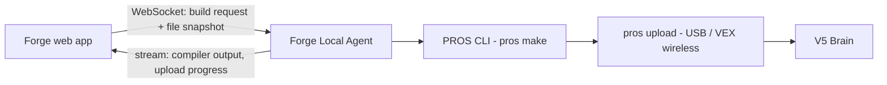

# Robot Deploy Architecture (Forge Local Agent)

> Status: **design document** — not yet implemented. This describes how Forge
> will build and deploy C++ code onto a VEX V5 robot in a future phase.

## Why a local agent

Forge's web app runs on Vercel serverless functions. Compiling PROS/VEXcode
projects requires the ARM GCC toolchain (hundreds of MB) and uploading to a
V5 Brain requires USB or VEX wireless access to hardware plugged into the
user's machine. Neither is possible from a serverless function, so the build
and upload steps must run **on the user's computer** via a small companion
process: the **Forge Local Agent**.

## Components

### 1. Forge Local Agent (Node CLI, `npx forge-agent`)

- Small Node.js CLI installed with `npx forge-agent connect <project-url>`
- Authenticates to the Forge web app with a one-time pairing code shown in
  the project workspace
- Holds a WebSocket connection; advertises capabilities (PROS CLI version,
  connected V5 devices found via `pros lsusb`)
- On a build request: writes the project file snapshot to a temp workspace,
  runs `pros make`, streams stdout/stderr back
- On a deploy request: runs `pros upload --slot <n>` and streams progress

### 2. Web app additions

- **Build & Deploy button** in the workspace header — disabled with a
  "Connect the Forge agent" hint until an agent is paired
- **Agent pairing endpoint** (`POST /api/projects/[id]/agent/pair`) issuing
  short-lived tokens
- **Build panel** — streams compiler output into the chat/Build Log, so
  compile errors become conversational context the assistant can fix
  (errors feed straight into the Claude Code-style edit loop: error →
  proposed fix block → Apply → rebuild)

### 3. Safety model

- The agent only executes the fixed, allow-listed commands (`pros make`,
  `pros upload`, `pros lsusb`) — never arbitrary shell from the web app
- File snapshots are written to an isolated temp dir, not the user's own
  working copy, unless the user opts into linking a local folder
- Pairing tokens are project-scoped and expire after 24h

## Why not cloud compile?

A Docker build worker (PROS toolchain image) could compile in the cloud and
return a `.bin`, but the upload step still requires local hardware access,
so a local agent is needed regardless. Cloud compile remains a potential
optimization later (compile in cloud, download artifact, agent only uploads).

## Prerequisites for implementation

- PROS CLI ≥ 3.5 installed locally (`pip install pros-cli`)
- Project must be a valid PROS project (`project.pros` present — already
  detected by Forge's indexer in `src/lib/indexer/robotics-detector.ts`)
- WebSocket transport (or polling fallback) between web app and agent
